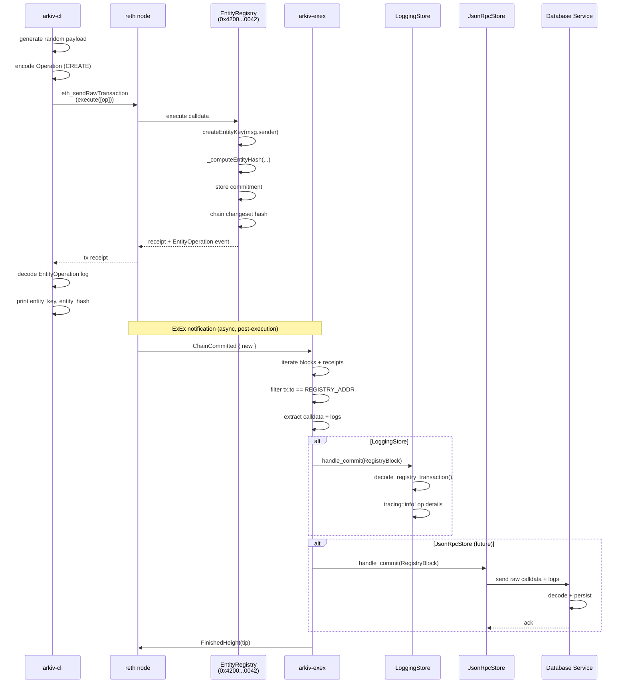

# Arkiv Node — Status & Architecture

## Current State

The Rust workspace comprises five crates that together form a complete chain indexing pipeline:

```
EntityRegistry (Solidity)
       |
       v  [genesis predeploy]
arkiv-genesis ──> revm deployment ──> chain spec
       |
       v
arkiv-node ──> reth ExEx ──> filters registry txs ──> arkiv-store
       |                                                    |
       v                                                    v
  CLI (arkiv-cli)                                  LoggingStore (debug)
  submits operations                               future: JSON-RPC store
  queries state
```

### Crate Summary

| Crate | Purpose | LOC | Status |
|-------|---------|-----|--------|
| **arkiv-bindings** | Solidity ABI types via `sol!` macro | 243 | Stable |
| **arkiv-store** | Storage trait + decode utilities + LoggingStore | 272 | Stable |
| **arkiv-genesis** | Genesis generation with revm-deployed EntityRegistry | 243 | Stable |
| **arkiv-node** | Reth node + ExEx thin filter | 135 | Functional |
| **arkiv-cli** | Transaction submission + queries + history | 353 | Feature-complete |

### What Works End-to-End

1. `just node-dev` boots a reth dev node with EntityRegistry predeployed at `0x4200...0042`
2. The ExEx starts and subscribes to chain notifications
3. `just cli create` submits an entity operation, gets back tx hash + entity key + entity hash
4. `just cli query --key <key>` reads the on-chain commitment
5. `just cli hash` returns the current changeset hash
6. `just cli history` walks the block linked list printing the changeset hash chain
7. `just spam 10` loops entity creates for load testing
8. LoggingStore logs decoded operations when the ExEx forwards matching transactions

---

## ExEx Architecture

### How reth ExEx Works

An Execution Extension (ExEx) is reth's plugin system for deriving custom state from the canonical chain. The lifecycle:

1. **Registration** — `builder.install_exex("name", |ctx| ...)` during node setup
2. **Launch** — The ExEx Manager spawns each ExEx as a background task after the node boots
3. **Notification stream** — As the engine finalizes blocks, it produces `ExExNotification` variants:
   - `ChainCommitted { new }` — New canonical blocks
   - `ChainReorged { old, new }` — Reorg: undo `old`, apply `new`
   - `ChainReverted { old }` — Rollback
4. **Backpressure** — The manager tracks each ExEx's progress via `FinishedHeight` events. Data isn't pruned until all ExExes have acknowledged it
5. **WAL** — Notifications are persisted to a write-ahead log. On crash recovery, unacknowledged notifications are replayed

### Arkiv ExEx Design: Thin Filter

The arkiv ExEx does minimal work — it's a filter, not a decoder:

```
Chain notification
  → iterate blocks + receipts
  → for each tx: is tx.to == ENTITY_REGISTRY_ADDRESS?
    → yes: extract calldata + filtered logs → RegistryTransaction
    → no: skip
  → if any found: wrap in RegistryBlock → store.handle_commit()
  → signal FinishedHeight
```

The ExEx passes raw calldata and logs to the Storage backend. Each store decides how much to decode:

- **LoggingStore** calls `decode_registry_transaction()` to fully parse operations, entity records, MIME types, and attributes — then logs everything via tracing
- **JSON-RPC store** (future) would serialize the raw `RegistryBlock` and forward it to an external database service, offloading all decode compute

This separation means the ExEx stays fast regardless of how expensive downstream processing becomes.

### Key Types

```rust
// What the ExEx produces (minimal, raw)
pub struct RegistryBlock {
    pub block_number: u64,
    pub transactions: Vec<RegistryTransaction>,
}

pub struct RegistryTransaction {
    pub tx_hash: B256,
    pub calldata: Bytes,
    pub logs: Vec<Log>,
    pub success: bool,
}

// What the Storage trait receives
pub trait Storage: Send + Sync + 'static {
    fn handle_commit(&self, block: &RegistryBlock) -> Result<()>;
    fn handle_revert(&self, block_number: u64) -> Result<()>;
}
```

### Generic Bound

The ExEx function is bound to `EthPrimitives` concretely rather than being fully generic:

```rust
pub async fn arkiv_exex<
    Node: FullNodeComponents<Types: NodeTypes<Primitives = EthPrimitives>>,
>
```

This matches reth's own examples and avoids trait bound gymnastics. Since this is an Ethereum-specific indexer, full generic flexibility isn't needed. If the project moves to op-reth (Optimism), the bound changes to `OpPrimitives`.

---

## Genesis System

`arkiv-genesis` bridges Foundry and reth:

1. **Build time** (`build.rs`): Runs `forge build` if Solidity sources changed, extracts creation bytecode from the Foundry artifact, embeds it as a Rust const
2. **Runtime** (`deploy.rs`): Spins up revm with the target chain_id, executes the creation bytecode, extracts runtime bytecode with correctly populated immutables (GENESIS_BLOCK=0, EIP-712 domain separator for the target chain)
3. **Genesis assembly** (`lib.rs`): Combines runtime bytecode + prefunded accounts + all-forks-active chain config into an `alloy_genesis::Genesis`
4. **Node integration** (`main.rs`): Converts Genesis to ChainSpec, overrides the builder's chain config before launch

The genesis is generated in-memory — no file on disk needed. `just print-genesis` writes it to stdout for inspection.

### Immutable Note

The EntityRegistry has 8 immutable values baked into bytecode by the constructor (EIP-712 fields, GENESIS_BLOCK). The revm deployment handles most correctly, but `_cachedThis` will be the revm deploy address, not `0x4200...0042`. OZ's EIP-712 implementation has a runtime fallback that recomputes the domain separator when `address(this) != _cachedThis`, so this is functionally correct at a small gas overhead.

---

## Potential Improvements

### Short Term

- **Verify block production** — The `launch_with_debug_capabilities()` fix for dev mode mining hasn't been confirmed end-to-end yet
- **ExEx error resilience** — Currently if `store.handle_commit()` fails, the ExEx stops. Consider whether failures should be logged and skipped to avoid blocking the node
- **Storage trait async** — When the JSON-RPC store is implemented, the trait may need to become async. For now sync is simpler and the ExEx context is async so `spawn_blocking` is available

### Medium Term

- **JSON-RPC Storage backend** — Implement a store that forwards `RegistryBlock` to an external database service via JSON-RPC. The DB service handles all decoding and persistence. This is the production architecture
- **Solidity interface (IEntityRegistry.sol)** — Extract a Solidity interface from EntityRegistry.sol. Use it as the single source of truth for both Solidity consumers and Rust bindings (via `sol!` with file path)
- **ExEx state checkpoint** — Persist the last processed block number so the ExEx can resume from where it left off after restart, rather than replaying from genesis. The reth WAL handles crash recovery, but a checkpoint avoids reprocessing on clean restart
- **Batch decode optimization** — The LoggingStore currently decodes each transaction independently. For high throughput, batch decoding could amortize allocation overhead

### Longer Term

- **op-reth migration** — The plan targets Optimism L2 eventually. This requires:
  - Changing `EthereumNode` to the OP node type
  - Updating the `EthPrimitives` bound to `OpPrimitives`
  - Adjusting genesis for L2 chain config (system transactions, L1 data fees)
  - The crate separation (arkiv-store has no reth deps) means most code stays unchanged
- **Off-chain verification** — Tooling to replay the changeset hash chain from indexed data and verify it matches the on-chain `changeSetHash()`. This is the core value proposition of the system
- **Multi-contract support** — The ExEx filter currently hardcodes `ENTITY_REGISTRY_ADDRESS`. If additional contracts are added (e.g., governance, access control), the filter should become configurable
- **Metrics and monitoring** — Add Prometheus metrics to the ExEx: blocks processed, transactions filtered, decode errors, processing latency. Reth already has a metrics infrastructure that ExExes can hook into

---

## Repo Decoupling: arkiv-contracts vs arkiv-op-reth

### Create Transaction Execution Path



### Guiding Principle

The split follows the direction of data flow. **arkiv-contracts** is upstream — it defines what the protocol _is_ (the contract, its ABI shape, its compiled bytecode). **arkiv-op-reth** is downstream — it consumes that definition to run an execution client, index transactions, store data, and expose a CLI.

### Proposed Split

**arkiv-contracts** — the protocol definition:

```
arkiv-contracts/
  src/                    # Solidity contracts
  test/                   # Solidity tests
  crates/
    arkiv-bindings/       # ABI types (sol! macro) + embedded compiled bytecode
  foundry.toml
  Cargo.toml
```

`arkiv-bindings` is the sole Rust crate. It represents the contract interface: types, selectors, events, constants, and the compiled bytecode. It has no reth, revm, or heavy framework dependencies — just `alloy-primitives`, `alloy-sol-types`, and `alloy-contract`. A `build.rs` runs `forge build` and embeds the creation bytecode as a const, so downstream consumers get both the ABI and the deployable artifact.

**arkiv-op-reth** — the execution node and tooling:

```
arkiv-op-reth/
  crates/
    arkiv-node/           # ExEx + node binary (op-reth)
    arkiv-store/          # Storage trait + decode + LoggingStore
    arkiv-genesis/        # Genesis generation (revm) — if needed
    arkiv-cli/            # Transaction CLI
  Cargo.toml
```

Everything downstream of the contract lives here: the ExEx that filters transactions, the storage backends that process them, the CLI that submits them. These crates depend on `arkiv-bindings` (from arkiv-contracts) as a git or published dependency.

### Why This Boundary

- **arkiv-bindings belongs with the contracts** because it is a direct representation of the Solidity source. When the contract changes shape (new fields, new events, new functions), the bindings must update in lockstep. Embedding the compiled bytecode here means any consumer gets a deployable artifact without needing Foundry.

- **arkiv-store belongs with the node** because it is a consumer of the contract definition, not part of it. The Storage trait, decode logic, and LoggingStore exist to serve the ExEx and CLI — they are downstream tooling. A different execution client (e.g., a geth-based indexer) would define its own storage interface.

- **arkiv-genesis is an open question.** It currently bridges Foundry artifacts and revm to produce a chain spec with EntityRegistry predeployed. Two options:

  1. **Keep in arkiv-op-reth** — The node binary constructs genesis at will using the bytecode from arkiv-bindings. This is simpler and avoids the question of how to combine Arkiv's genesis with Optimism's genesis (which includes L1Block, L2ToL1MessagePasser, and other system contracts). The node owns its chain configuration.

  2. **Drop it entirely** — If the OP stack provides its own genesis tooling, Arkiv's predeploy could be injected via OP's genesis generation pipeline rather than a custom Rust crate. The bytecode is available from arkiv-bindings; the node just needs to place it at the predeploy address during genesis construction, however that's done in the OP ecosystem.

  For now, keeping it in arkiv-op-reth and treating it as a convenience is pragmatic. It can be removed if OP's genesis pipeline subsumes its function.

- **arkiv-cli belongs with the node** because it's a testing and operational tool for the execution environment. It submits transactions, reads state, walks history — all actions against a running node. It depends on arkiv-bindings for the ABI but lives alongside the node it operates against.

### Dependency Flow

```
arkiv-contracts (upstream, published)
  arkiv-bindings
    - ABI types, selectors, events, constants
    - Embedded compiled bytecode (creation + deployed)
    - alloy-primitives, alloy-sol-types, alloy-contract
         │
         │  git dep / crates.io
         ▼
arkiv-op-reth (downstream)
  arkiv-node ──► arkiv-store ──► arkiv-bindings
    │                │
    │                └── decode.rs (uses bindings for ABI parsing)
    │
    ├── arkiv-genesis (optional, uses bindings for bytecode)
    └── arkiv-cli ──► arkiv-bindings
```

### Optimism Migration

The Optimism project maintains [op-reth](https://github.com/ethereum-optimism/optimism/tree/develop/rust):
- `op-reth` — OP-flavoured reth node
- `op-alloy` — OP-specific Alloy types (deposit transactions, L1 data)
- `op-revm` — OP EVM executor
- `alloy-op-hardforks` — OP fork definitions

Key differences from vanilla reth:

| Aspect | Ethereum (current) | Optimism |
|--------|-------------------|----------|
| Node type | `EthereumNode` | `OpNode` (from op-reth) |
| Primitives | `EthPrimitives` | `OpPrimitives` (adds deposit txs) |
| Consensus | PoS (beacon chain) | L1-derived (sequencer) |
| Payload builder | Local block building | Sequencer-driven |
| System txs | None | L1 attributes deposit tx per block |
| Dev mode | `--dev` with local miner | Sequencer mock or devnet |
| Genesis | Standard Ethereum alloc | OP system contracts (L1Block, etc.) |

**What changes in arkiv-node:**
- `EthereumNode` → `OpNode`
- `EthPrimitives` → `OpPrimitives` in the ExEx generic bound
- Genesis construction must integrate with OP's system contract predeploys rather than standalone
- Dev mode needs OP's sequencer tooling rather than reth's built-in local miner

**What stays the same:**
- `arkiv-bindings` — EntityRegistry ABI is chain-agnostic
- `arkiv-store` — Storage trait and decode logic have no chain knowledge
- `arkiv-cli` — Uses Alloy provider, works with any EVM RPC
- The ExEx filter logic (address comparison, calldata + log extraction) is identical

### Genesis and OP: The Hanging Question

OP chains have their own genesis format with ~15 system contracts predeployed. Arkiv's EntityRegistry would be one more predeploy in that set. How to combine them:

1. **OP genesis toolchain injects Arkiv** — OP has `op-deployer` and genesis generation scripts. Arkiv's bytecode (from arkiv-bindings) is provided as input, and the OP toolchain places it at the predeploy address alongside its own system contracts. This is the cleanest approach — no custom genesis crate needed in arkiv-op-reth.

2. **arkiv-genesis merges with OP genesis** — The Rust crate generates a partial alloc (just the EntityRegistry entry) that gets merged into the OP genesis. This requires understanding OP's genesis format and ensuring no conflicts.

3. **Avoid the problem in dev** — For local development, use OP's devnet tooling to produce a genesis with Arkiv predeployed. Don't build custom convenience that fights the OP stack's own mechanisms.

The recommendation is option 1. The `arkiv-genesis` crate is useful during the current Ethereum-only prototyping phase. When moving to OP, it may be simpler to feed the bytecode into OP's existing genesis pipeline rather than maintaining a parallel system.

### Migration Path

**Step 1: Consolidate arkiv-bindings as the contract interface**

arkiv-bindings becomes the single bridge between Solidity and Rust. Move the bytecode embedding (currently in arkiv-genesis's `build.rs`) into arkiv-bindings' `build.rs`. After this, arkiv-bindings exports:
- ABI types, selectors, events, constants (existing)
- `ENTITY_REGISTRY_CREATION_CODE` — compiled creation bytecode (moved from arkiv-genesis)

This makes arkiv-bindings self-contained: any downstream consumer gets both the type-safe interface and the deployable artifact without needing Foundry or revm.

**Step 2: Create arkiv-op-reth repo**

Create a new workspace at `arkiv-op-reth/`. Move these crates out of arkiv-contracts:
- `arkiv-node` — ExEx + node binary
- `arkiv-store` — Storage trait + decode + LoggingStore
- `arkiv-cli` — transaction CLI + spam tooling
- `arkiv-genesis` — genesis generation (consumes bytecode from arkiv-bindings now)

Each depends on `arkiv-bindings` as a git dependency pointing at arkiv-contracts. The workspace Cargo.toml in arkiv-op-reth pins the reth/alloy versions independently from the contracts repo.

**Step 3: Clean up arkiv-contracts**

Remove the moved crates from the workspace. Strip reth, revm, and heavy framework deps from workspace Cargo.toml. What remains:
```
arkiv-contracts/
  src/              # Solidity source
  test/             # Solidity tests
  crates/
    arkiv-bindings/ # ABI types + embedded bytecode
  foundry.toml
  Cargo.toml        # Single-member workspace
```

The justfile shrinks to Solidity-only recipes (build, test, lint, coverage). Rust node/CLI recipes move to arkiv-op-reth's justfile.

**Step 4: OP migration (in arkiv-op-reth)**

With the split done, OP migration is scoped entirely to arkiv-op-reth:
- Swap `reth-node-ethereum` for `op-reth` dependencies
- Change `EthereumNode` → `OpNode`, `EthPrimitives` → `OpPrimitives`
- Integrate with OP's genesis and devnet tooling — likely drop arkiv-genesis in favour of feeding bytecode (from arkiv-bindings) into OP's genesis pipeline
- Dev mode changes from reth's `--dev` local miner to OP's sequencer mock

The ExEx filter logic, Storage trait, decode module, and CLI carry over with minimal changes. arkiv-contracts is untouched.

---

## Development Workflow

```bash
# Dev environment
direnv allow                    # Load nix dev shell

# Solidity
just build                      # Compile contracts
just test                       # Run Solidity tests
just lint                       # Lint contracts

# Rust
cargo check --workspace         # Type check all crates
cargo test --workspace          # Run all Rust tests

# Integration
just node-dev                   # Boot dev node (terminal 1)
just cli create --expires-in 1h # Submit operation (terminal 2)
just cli history                # Inspect changeset chain
just spam 20                    # Load test

# Utilities
just print-genesis              # Inspect genesis JSON
just cli balance                # Check dev account
just cli hash                   # Current changeset hash
```
